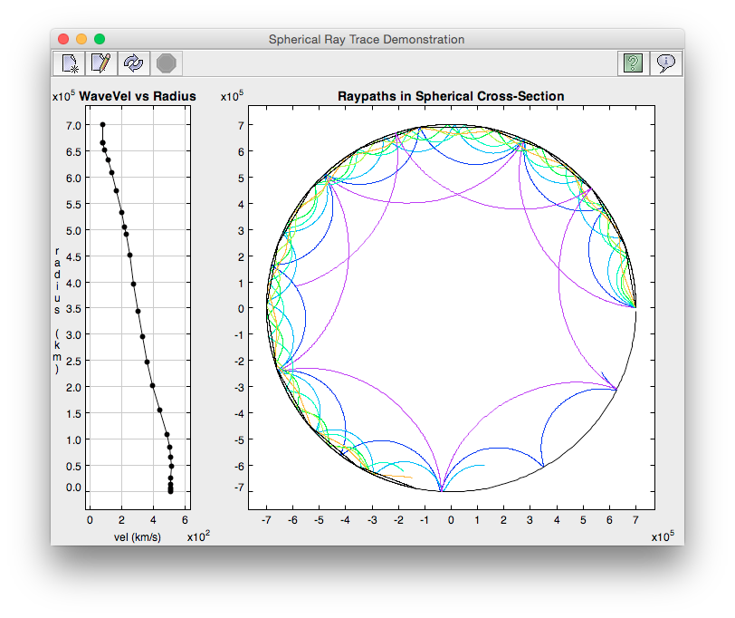
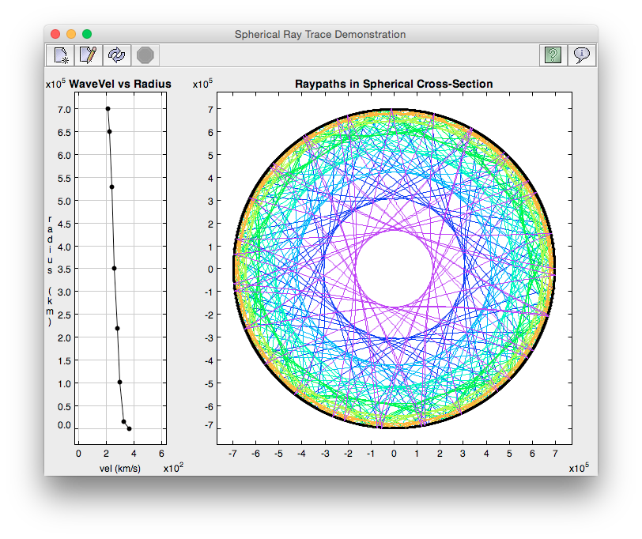

SpheRayDemo, 2005-2015  
Andy Ganse, Applied Physics Laboratory, University of Washington  
aganse@apl.washington.edu  

----------------------------------------------------------------
Dependencies: 
* ptolemy.plot (PTPlot v2.0):
  http://ptolemy.eecs.berkeley.edu/java/ptolemy.plot2.0/ptolemy/plot/

* edu.washington.apl.aganse.ptolemyUpdates:
  https://github.com/aganse/ptolemyUpdates

* edu.washington.apl.aganse.dataTools:
  https://github.com/aganse/dataTools

----------------------------------------------------------------

SpheRayDemo is a "spherical raytrace demonstration", an interactive,
graphical, helioseismic raytrace applet.  Helioseismic means seismology
of the Sun - ion-acoustic waves actually propagate inside the Sun just
like sound and earthquake waves propagate in the Earth; they pass
through different internal layers before refracting back up to the
surface where they cause brightness fluctuations that can be measured.
So just like Earth seismology provides a tool for measuring structure
inside the Earth, helioseismology provides a tool for measuring
structure inside the Sun.  Cool huh?

SpheRayDemo demonstrates how these ion-acoustic waves refract and
reflect inside the Sun.  (I.e. the velocity profile examples
and the plot scales are geared for the Sun case - but a similar app
could similarly represent earthquake waves propagating in the globe
of the Earth.)

You can download and compile the source, or just download and use
the application jarfile, spheraydemo.jar.  Run it at commandline via:

`> java -jar spheraydemo.jar`

The class is designed to be run as either an independent application
or as a webapge applet.  Please see my webpages on this app (and for
an intro to the topic of helioseismology) for more information:
* http://staff.washington.edu/aganse/helioseis/intro.html
* http://staff.washington.edu/aganse/helioseis/helioseis_rtapplet.html

The small SpheRayDemo.html file (or the page source of the applet
webpage above for that matter) demonstrates calling the code as an
applet.  (Alas this code is poorly commented, sorry... on the to-do list.)

See screenshot1.png or the webapges above for what the app looks like.
Quick running instructions:  after starting the application via above,
right-click on the WaveVel vs Depth plot (left) and choose say
"B-P 2000 Model" velocity profile from menu (you can also click in
your own points, either from scratch or adding to the chosen menu
profile).  Then click the swirly-arrows button in toolbar to run
the raytrace and see the raypaths on the right.  

Note too the "edit" button at top left - artistically speaking, the
greater the "max iterations" value the closer the result looks to
a Spirograph picture!  See e.g. screenshot2.png.

